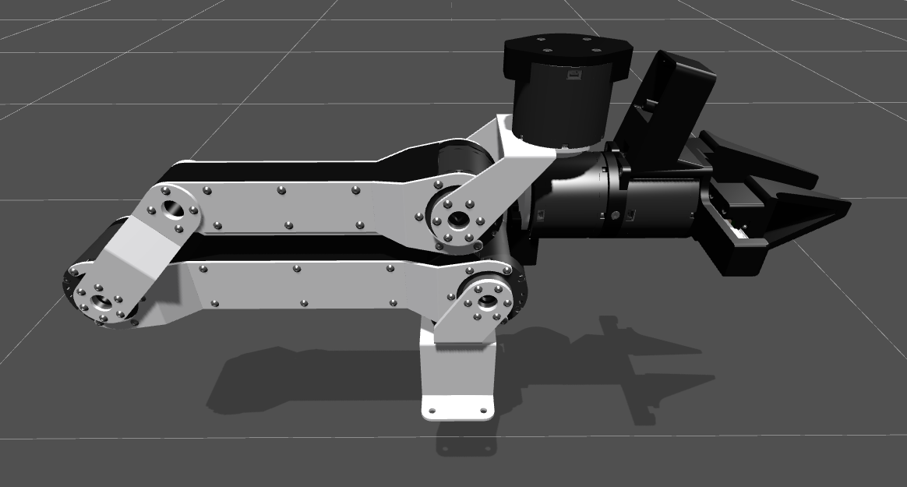

<p align="center">
    
</p>
<p align="center">
    <a href="https://docs.robot-learning.co/">
        </a>
    <a href="https://discord.gg/PTZ3CN5WkJ">
        </a>
    <a href="https://x.com/JannikGrothusen">
        </a>
    <a href="https://www.robot-learning.co/">
        </a>
</p>

<h1 align="center">An Open Source Dev Kit for AI-native Robotics</h1>
<p align="center">by The Robot Learning Company</p>

## Demo

<p align="center">
    
</p>

## CAD

<table align="center">
<tr>
<td width="50%">
<a href="https://github.com/robot-learning-co/trlc-dk1/blob/main/hardware/TRLC-DK1-Follower_v0.3.0.step" target="_blank">
TRLC-DK1 v0.3.0 Follower CAD<br>

</a>
</td>
<td width="50%">
<a href="https://a360.co/481PSQH" target="_blank">
TRLC-DK1 v0.2.0 Leader CAD<br>

</a>
</td>
</tr>
</table>
Copyright 2025-2026 The Robot Learning Company UG (haftungsbeschränkt). All rights reserved.

## Installation

```
git clone https://github.com/robot-learning-co/trlc-dk1.git
uv venv
uv pip install -e .
```
This repo uses [LeRobot's plugin conventions](https://huggingface.co/docs/lerobot/integrate_hardware#using-your-own-lerobot-devices-) to be automatically detected by a LeRobot installation in the same Python environment.


## Examples

Use [LeRobot's CLI](https://huggingface.co/docs/lerobot/il_robots) to identify your teleop, robot, and camera ports:

```
uv run lerobot-find-port
uv run lerobot-find-cameras
```

<details>
<summary>Example I: Single Arm Teleoperation
</summary>

```bash
uv run lerobot-teleoperate \
    --robot.type=dk1_follower \
    --robot.port=/dev/ttyACM0 \
    --robot.joint_velocity_scaling=0.2 \
    --teleop.type=dk1_leader \
    --teleop.port=/dev/ttyACM1 \
    --robot.cameras="{ 
        context: {type: opencv, index_or_path: 0, width: 1280, height: 720, fps: 60, fourcc: "MJPG"}, 
        wrist: {type: opencv, index_or_path: 1, width: 1280, height: 720, fps: 60, rotation: 180, fourcc: "MJPG"}
      }" \
    --display_data=true
```
</details>

<details>
<summary>Example II: Bimanual Recording
</summary>

```bash
lerobot-record \
    --robot.type=bi_dk1_follower \
    --robot.right_arm_port=/dev/ttyACM0 \
    --robot.left_arm_port=/dev/ttyACM1 \
    --robot.joint_velocity_scaling=1.0 \
    --teleop.type=bi_dk1_leader \
    --teleop.right_arm_port=/dev/ttyACM2 \
    --teleop.left_arm_port=/dev/ttyACM3 \
    --robot.cameras="{ 
        head: {type: opencv, index_or_path: /dev/video0, width: 960, height: 540, fps: 60, fourcc: "MJPG"},
        right_wrist: {type: opencv, index_or_path: /dev/video2, width: 960, height: 540, fps: 60, rotation: 180, fourcc: "MJPG"},
        left_wrist: {type: opencv, index_or_path: /dev/video4, width: 960, height: 540, fps: 60, rotation: 180, fourcc: "MJPG"},
      }" \
    --dataset.repo_id=$USER/my_test_dataset \
    --dataset.push_to_hub=false \
    --dataset.num_episodes=3 \
    --dataset.episode_time_s=30 \
    --dataset.reset_time_s=20 \
    --dataset.single_task="Test the LeRobot recording pipeling."
```
</details>

## URDF

<p align="center">
    
</p>

The follower arm URDF with visual (GLB) and collision (STL) meshes is available in [`urdf/follower/`](urdf/follower/).

## Acknowledgements

- [GELLO](https://wuphilipp.github.io/gello_site/) by Philipp Wu et al.
- [Low-Cost Robot Arm](https://github.com/AlexanderKoch-Koch/low_cost_robot) by Alexander Koch
- [LeRobot](https://github.com/huggingface/lerobot) by HuggingFace, Inc.
- [SO-100](https://github.com/TheRobotStudio/SO-ARM100) by TheRobotStudio
- [OpenArm](https://openarm.dev/) by Enactic, Inc.
